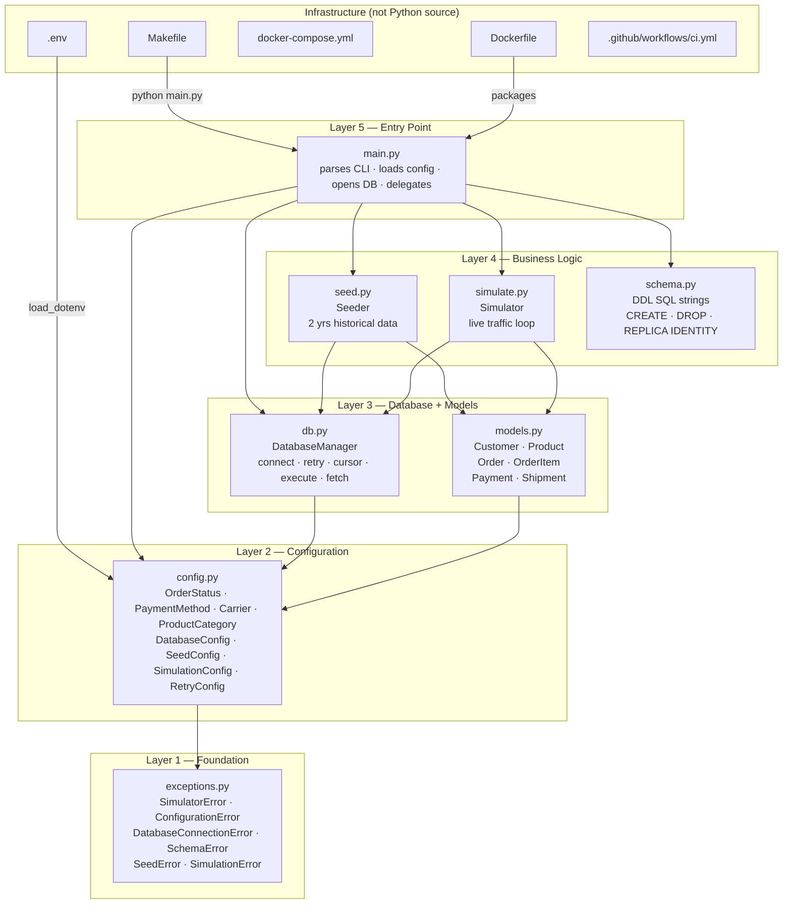

# platform-cdc-simulator

This repository is part of the [Enterprise Data Platform](https://github.com/enterprise-data-platform-emeka/platform-docs). For the full project overview, architecture diagram, and build order, start there.

---

A realistic e-commerce OLTP (Online Transaction Processing) data generator for the Enterprise Data Platform. It writes customer orders, payments, and shipments into a PostgreSQL (Postgres) database so AWS DMS (Database Migration Service) can capture every change and forward it to the Bronze S3 (Simple Storage Service) layer. Without this simulator, there's no source data to flow through the pipeline. It's the starting gun.

---

## Contents

- [What it does](#what-it-does)
- [Data model](#data-model)
- [How much data it creates](#how-much-data-it-creates)
- [Prerequisites](#prerequisites)
- [Local setup (Docker)](#local-setup-docker)
- [Cloud setup (AWS RDS via SSM tunnel)](#cloud-setup-aws-rds-via-ssm-tunnel)
- [All commands](#all-commands)
- [Configuration reference](#configuration-reference)
- [Running tests](#running-tests)
- [Docker](#docker)
- [Code structure](#code-structure)
- [CI/CD](#cicd)
- [How DMS reads this data](#how-dms-reads-this-data)

---

## What it does

The simulator does three things in sequence:

1. **Schema**: creates six tables that mirror a real e-commerce system, sets `REPLICA IDENTITY FULL` on every table (required for DMS CDC), and adds `updated_at` triggers.
2. **Seed**: fills the database with two years of historical data (customers, products, orders with realistic lifecycle distributions).
3. **Simulate**: runs a continuous loop that places new orders, advances orders through statuses (pending → confirmed → shipped → delivered), completes payments, creates shipment records, and occasionally cancels or refunds orders.

Every write lands in PostgreSQL's WAL (Write-Ahead Log), which is PostgreSQL's internal record of every change. AWS DMS reads the WAL and writes each change to S3 as a Parquet file. That's CDC (Change Data Capture) in action.

---

## Data model

Six tables representing a European e-commerce business:

```
customers ──< orders ──< order_items >── products
                │
                ├──< payments
                └──< shipments
```

| Table | Key columns |
|---|---|
| `customers` | customer_id, first_name, last_name, email, country, phone, signup_date |
| `products` | product_id, name, category, brand, unit_price, stock_qty |
| `orders` | order_id, customer_id, order_date, order_status |
| `order_items` | order_item_id, order_id, product_id, quantity, unit_price, line_total |
| `payments` | payment_id, order_id, method, amount, status, payment_date |
| `shipments` | shipment_id, order_id, carrier, delivery_status, shipped_date, delivered_date |

Every table also has an `updated_at` column that updates automatically on every row change via a PostgreSQL trigger.

**Order lifecycle:** `pending` → `confirmed` → `processing` → `shipped` → `delivered`

Terminal states (no further transitions): `delivered`, `cancelled`, `refunded`

**Why `REPLICA IDENTITY FULL`?** PostgreSQL normally only writes changed columns to the WAL on an UPDATE. DMS needs the complete old row to produce a full CDC event. Setting `REPLICA IDENTITY FULL` tells PostgreSQL to write the entire old row on every change.

---

## How much data it creates

The simulator respects per-environment limits so it never creates more data than needed:

| Environment | Max orders | Seed customers | Seed products | Seed historical orders |
|---|---|---|---|---|
| `dev` | 5,000 | 500 | 200 | 2,000 |
| `staging` | 10,000 | 1,000 | 400 | 5,000 |
| `prod` | 15,000 | 2,000 | 800 | 10,000 |

Once the order limit is reached, the simulator stops creating new orders but keeps advancing existing ones (status transitions, shipments, refunds). The CDC stream stays active without the database growing indefinitely.

---

## Prerequisites

**For local development:**

- Python 3.11.8, managed by pyenv (see setup below)
- Docker Desktop, for the local PostgreSQL container
- Git

**For AWS (in addition to the above):**

- AWS CLI configured with SSO profiles (`dev-admin`, `staging-admin`, `prod-admin`)
- AWS SSM (Systems Manager) Session Manager Plugin:
  ```bash
  brew install --cask session-manager-plugin
  ```
- Terraform infrastructure applied (`make apply dev` in `terraform-platform-infra-live`)

---

## Local setup (Docker)

This runs everything on your Mac with a local PostgreSQL container. No AWS account or costs involved.

**Step 1: Install pyenv**

pyenv manages Python versions. The `.python-version` file in this repo tells pyenv to use 3.11.8 automatically when you `cd` into the project.

```bash
brew install pyenv
echo 'export PYENV_ROOT="$HOME/.pyenv"' >> ~/.zshrc
echo '[[ -d $PYENV_ROOT/bin ]] && export PATH="$PYENV_ROOT/bin:$PATH"' >> ~/.zshrc
echo 'eval "$(pyenv init -)"' >> ~/.zshrc
source ~/.zshrc
pyenv install 3.11.8
```

Verify: `python --version` should show `Python 3.11.8` inside this directory.

**Step 2: Create the virtual environment**

```bash
cd platform-cdc-simulator
make setup
```

This creates a `.venv` folder with all Python packages installed. The packages are isolated, so they don't affect anything else on your Mac.

**Step 3: Configure the environment**

```bash
cp .env.example .env
```

The `.env` file already has the right values for local Docker development. You don't need to change anything.

**Step 4: Start the local PostgreSQL database**

```bash
make docker-up
```

This starts a PostgreSQL container on port 5432. It also creates two databases automatically:
- `ecommerce`: the simulator's database
- `ecommerce_test`: used by the integration test suite (keeps test runs isolated from simulator data)

Wait for the output `PostgreSQL is ready.` before continuing.

**Step 5: Create the schema and seed data**

```bash
make schema    # create the six tables, indexes, and triggers
make seed      # fill with 2 years of historical data (~2,000 orders for dev)
```

**Step 6: Run the simulator**

```bash
make simulate  # starts the live traffic loop — Ctrl+C to stop
```

You'll see log output every few seconds showing new orders being placed and existing ones advancing through their lifecycle. Every write also appears in the PostgreSQL WAL.

**Reset to a clean state at any time:**

```bash
make reset     # drops all tables, recreates schema, reseeds — destroys all data
```

---

## Cloud setup (AWS RDS via SSM tunnel)

RDS lives in private subnets with no internet route. To connect from your Mac, you open an SSM (Systems Manager) port-forwarding session through the bastion EC2 (Elastic Compute Cloud) instance Terraform creates. No SSH keys and no open firewall ports are needed. The connection goes entirely through AWS's private network.

**Before starting, make sure:**

1. Infrastructure is applied: `make apply dev` completed in `terraform-platform-infra-live`
2. SSM Session Manager Plugin is installed (`brew install --cask session-manager-plugin`)
3. Your AWS SSO session is active: `aws sso login --profile dev-admin`

**Step 1: Get the tunnel command from Terraform output**

After `make apply dev`, Terraform prints an `ssm_tunnel_command` output. Copy it. It looks like this:

```
ssm_tunnel_command = "aws ssm start-session --target i-0abc123 --document-name AWS-StartPortForwardingSessionToRemoteHost --parameters 'host=edp-dev-source-db.xxx.eu-central-1.rds.amazonaws.com,portNumber=5432,localPortNumber=5433' --profile dev-admin"
```

If you need to retrieve it again later:

```bash
cd terraform-platform-infra-live/environments/dev
terraform output ssm_tunnel_command
```

**Step 2: Open the SSM tunnel (Terminal 1)**

Paste and run the tunnel command. You'll see:

```
Starting session with SessionId: dev-admin-xxxxxxxxxx
Port 5433 forwarded
Waiting for connections...
```

Leave this terminal open. The tunnel must stay running while the simulator is active. If it closes, the simulator loses its connection to RDS.

**Step 3: Verify the tunnel is working (optional)**

In a new terminal:

```bash
psql -h localhost -p 5433 -U postgres -d ecommerce
```

If it prompts for a password, the tunnel is working. Ctrl+C to exit without entering a password.

**Step 4: Run the simulator (Terminal 2)**

```bash
cd platform-cdc-simulator
make schema ENV=dev     # create tables on AWS RDS
make seed   ENV=dev     # seed historical data
make simulate ENV=dev   # run the live traffic loop (Ctrl+C to stop)
```

The Makefile fetches the RDS password live from AWS SSM Parameter Store, so no password file is ever created on disk. It calls:

```bash
aws ssm get-parameter \
  --name /edp/dev/rds/db_password \
  --with-decryption \
  --query Parameter.Value \
  --output text \
  --profile dev-admin
```

Then sets `DB_HOST=localhost`, `DB_PORT=5433`, and all other variables before running the simulator.

**Step 5: Verify data in S3 (optional)**

Once DMS picks up the changes (usually within 1-2 minutes of starting the DMS task), Parquet files appear in the Bronze bucket:

```bash
aws s3 ls s3://edp-dev-{account-id}-bronze/raw/ --recursive --profile dev-admin
```

**Step 6: Stop and clean up**

Stop the simulator with Ctrl+C in Terminal 2. Close the SSM tunnel in Terminal 1 with Ctrl+C. Then destroy all infrastructure:

```bash
cd terraform-platform-infra-live
make destroy dev
```

**Switching environments:**

Replace `ENV=dev` with `ENV=staging` or `ENV=prod`. The Makefile uses the matching AWS profile (`staging-admin` / `prod-admin`) and SSM path automatically.

---

## All commands

```bash
# Setup
make setup              # create .venv and install all dependencies

# Code quality
make lint               # run ruff linter
make typecheck          # run mypy type checker
make test               # run all tests (unit + integration, reads .env)
make test-unit          # run unit tests only (no database required)
make test-integration   # run integration tests (requires a running PostgreSQL)

# Simulator — local Docker (reads .env)
make schema             # create tables, indexes, triggers
make seed               # seed 2 years of historical data
make simulate           # run the live traffic loop (Ctrl+C to stop)
make reset              # drop + recreate + reseed (destroys all data)

# Simulator — AWS RDS (SSM tunnel must be open first)
make schema ENV=dev     # create tables on AWS dev RDS
make seed   ENV=dev     # seed on AWS dev RDS
make simulate ENV=dev   # run loop against AWS dev RDS
make reset  ENV=dev     # reset AWS dev RDS (destroys all data)

# Docker
make docker-up          # start local PostgreSQL container
make docker-down        # stop and remove containers
make docker-logs        # tail container logs
make docker-build       # build the simulator Docker image
make docker-simulate    # start PostgreSQL + simulator together in Docker

# Cleanup
make clean              # remove .venv and Python cache files
```

---

## Configuration reference

All configuration comes from environment variables. For local runs, these are loaded from `.env`. For AWS runs (`ENV=dev/staging/prod`), the Makefile sets them inline.

| Variable | Required | Default | Description |
|---|---|---|---|
| `ENVIRONMENT` | Yes | none | `dev`, `staging`, or `prod`. Controls record limits. |
| `DB_HOST` | Yes | none | PostgreSQL hostname. `localhost` for both Docker and SSM tunnel. |
| `DB_PORT` | No | `5432` | `5432` for Docker, `5433` for SSM tunnel (local port). |
| `DB_NAME` | Yes | none | Database name. `ecommerce` in all environments. |
| `DB_USER` | Yes | none | Database user. `postgres` in all environments. |
| `DB_PASSWORD` | Yes | none | Database password. Set in `.env` for local, fetched from SSM for AWS. |
| `TEST_DB_NAME` | No | `ecommerce_test` | Database for integration tests. Never the same as `DB_NAME`. |
| `SEED_CUSTOMERS` | No | env default | Override seed customer count. |
| `SEED_PRODUCTS` | No | env default | Override seed product count. |
| `SEED_HISTORICAL_ORDERS` | No | env default | Override seed order count. |
| `SEED_RANDOM_SEED` | No | `42` | Random seed for reproducible data generation. |
| `SIM_TICK_INTERVAL_SECONDS` | No | `2` | Seconds between simulation ticks. |
| `SIM_NEW_ORDERS_PER_TICK` | No | `3` | New orders placed per tick. |
| `SIM_MAX_ORDERS` | No | env default | Override the environment order cap. |
| `RETRY_MAX_ATTEMPTS` | No | `5` | Max DB reconnection attempts on connection loss. |
| `RETRY_WAIT_MIN_SECONDS` | No | `1` | Minimum wait between retry attempts. |
| `RETRY_WAIT_MAX_SECONDS` | No | `30` | Maximum wait between retry attempts. |

Copy `.env.example` to `.env` and fill in your values. The real `.env` is in `.gitignore`, so passwords never end up in git.

---

## Running tests

**Unit tests (no database required):**

```bash
make test-unit
```

Runs all tests that don't need a database. Tests config loading, exception hierarchy, model generation, and SQL DDL strings.

**Integration tests (requires PostgreSQL):**

For local Docker:
```bash
make docker-up
make test
```

For AWS RDS (SSM tunnel must be open):
```bash
make test ENV=dev
```

Integration tests use `TEST_DB_NAME` (default: `ecommerce_test`), never `DB_NAME`. The test fixture creates a fresh schema before each test and drops it after, so tests can never corrupt your simulator data. Every integration test runs in complete isolation.

**Test coverage:**

| File | Type | What it tests |
|---|---|---|
| `test_exceptions.py` | Unit | Exception hierarchy and message preservation |
| `test_config.py` | Unit | Domain constants, env var loading, password redaction in repr |
| `test_models.py` | Unit | Model factories, `as_insert_tuple()`, `line_total` calculation |
| `test_schema.py` | Unit | SQL strings contain all table names, `REPLICA IDENTITY FULL`, `CASCADE` |
| `test_db.py` | Integration | Connect, execute, fetch, bulk insert, transaction rollback |

---

## Docker

**Local development stack:**

```bash
make docker-up        # start PostgreSQL only (recommended for development)
make docker-simulate  # start PostgreSQL + simulator together
make docker-down      # stop everything
make docker-logs      # tail logs from all containers
```

**Build and push the simulator image:**

```bash
make docker-build     # builds cdc-simulator:latest locally
```

The `Dockerfile` uses a two-stage build: stage one installs Python packages, stage two copies only what's needed into a slim final image. The container runs as a non-root user. This image can be deployed to AWS ECS (Elastic Container Service) to run the simulator in the cloud without needing a laptop connection.

On merge to `main`, GitHub Actions automatically builds and pushes the image to GitHub Container Registry.

---

## Code structure

Each file has a single, clearly defined role. Files in higher layers only import from lower layers, never sideways or upward. This one-way dependency flow means changes have predictable blast radius.



**What each file does:**

| File | Role |
|---|---|
| `main.py` | CLI entry point. Parses `schema / seed / simulate / reset`, loads and validates all config before opening a DB connection, then calls the right class. The only file that touches every layer. |
| `simulator/config.py` | Domain constants (`OrderStatus`, `PaymentMethod`, `Carrier`, etc.) and frozen config dataclasses. `ENVIRONMENT` drives record limits automatically, so there are no hardcoded numbers to change when switching environments. |
| `simulator/db.py` | `DatabaseManager` wraps psycopg2. Handles connect with exponential-backoff retry, a `cursor()` context manager that auto-commits on success and rolls back on any failure, and helper methods for bulk inserts and reads. |
| `simulator/models.py` | Dataclasses for each table (`Customer`, `Product`, `Order`, `OrderItem`, `Payment`, `Shipment`). Each has a `generate()` factory using Faker and an `as_insert_tuple()` method that matches the INSERT column order. |
| `simulator/schema.py` | Pure SQL DDL strings: CREATE TABLE, indexes, `updated_at` triggers, `REPLICA IDENTITY FULL`, and DROP TABLE. No Python logic, just SQL kept in one place. |
| `simulator/seed.py` | `Seeder` class. Inserts customers and products first, then creates historical orders with realistic lifecycle distributions (most old orders delivered, a fraction cancelled or refunded, recent ones still in transit). Raises `SeedError` on any failure. Never partial. |
| `simulator/simulate.py` | `Simulator` class. Runs the continuous tick loop: new orders, status advances, shipment tracking, cancellations, refunds, organic customer sign-ups. `DatabaseConnectionError` triggers a reconnect; all other errors crash loudly. |
| `simulator/exceptions.py` | Exception hierarchy rooted at `SimulatorError`. Named exceptions mean callers catch exactly what they expect and everything else crashes with context. |
| `tests/conftest.py` | Shared pytest fixtures. The `db` fixture uses `TEST_DB_NAME` (not `DB_NAME`) and creates + drops the schema around each test, so tests never touch simulator data. |

---

## CI/CD

CI skips runs triggered by README or `.env.example` changes. Only source code, configuration, and Dockerfile changes trigger the pipeline.

### On every pull request and push to main

Four jobs run in two waves:

**Wave 1 (parallel):**

| Job | What it checks |
|---|---|
| Lint and type check | ruff (style) + mypy (types) on `simulator/` and `main.py` |
| Unit tests | pytest unit tests with coverage report (no database needed) |

**Wave 2 (only if wave 1 passes, parallel):**

| Job | What it checks |
|---|---|
| Integration tests | pytest integration tests against a real PostgreSQL service container that GitHub provisions automatically |
| Docker build | Verifies the Dockerfile builds cleanly (no push in CI) |

### On merge to main

The deploy workflow triggers automatically after CI passes. It builds the Docker image and pushes it to GitHub Container Registry (GHCR) tagged as `dev` and `dev-{sha}`. No AWS credentials are needed, it authenticates using the built-in `GITHUB_TOKEN`.

### Promotion to staging and prod

Trigger the Deploy workflow manually from GitHub Actions, choose the target environment. The image is rebuilt and pushed with the matching environment tag (`staging`, `prod`). The `prod` push also updates the `latest` tag. GitHub Environment protection rules require reviewer approval for staging and prod before the job runs.

---

## How DMS reads this data

AWS DMS connects to PostgreSQL as a replication client and subscribes to the WAL stream. For each change the simulator writes, DMS produces a Parquet file in the Bronze S3 bucket partitioned by date:

```
s3://edp-dev-{account-id}-bronze/raw/
└── customers/
    └── 20240115/
        ├── LOAD00000001.parquet        ← full table snapshot (first run)
        └── 20240115-102301-0001.parquet ← CDC events (inserts, updates, deletes)
```

The Bronze layer is append-only. The Glue PySpark jobs in `platform-glue-jobs` read these files, resolve the CDC operations, and write a clean deduplicated Silver layer.
