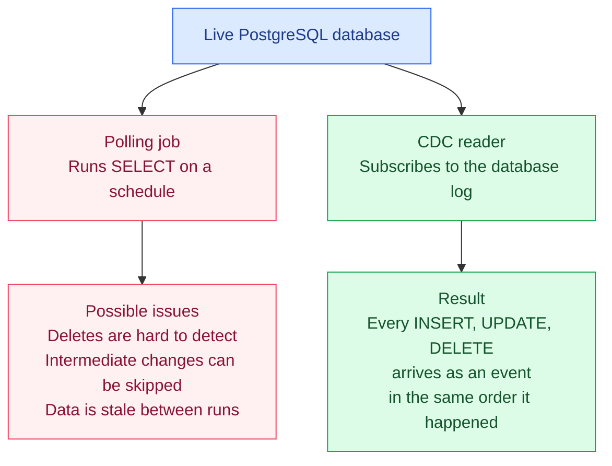
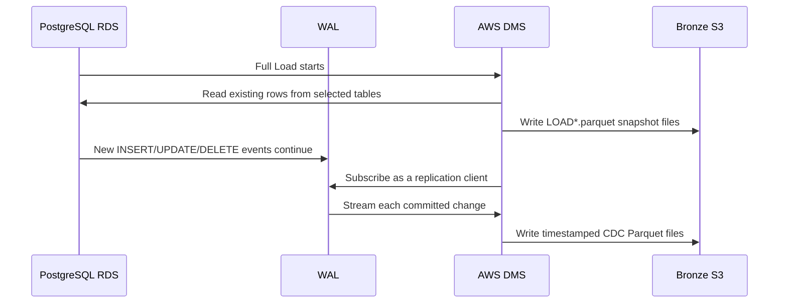
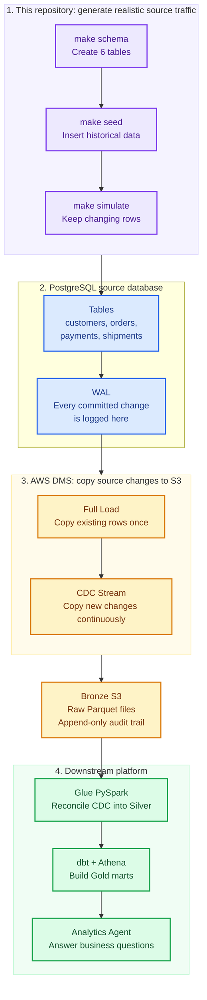
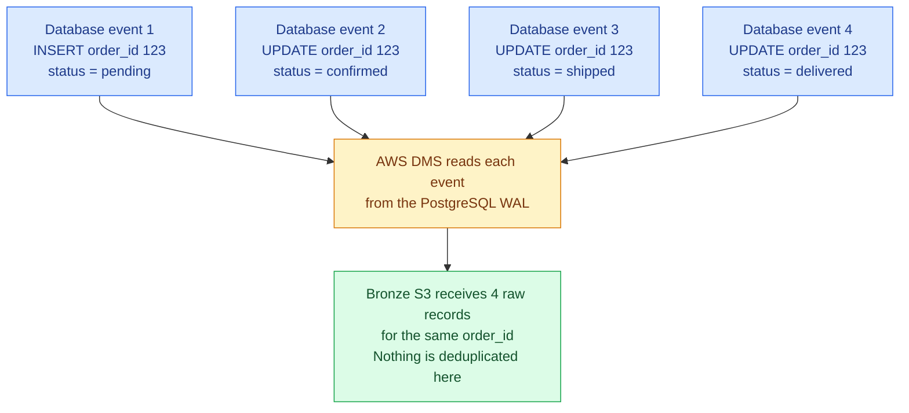
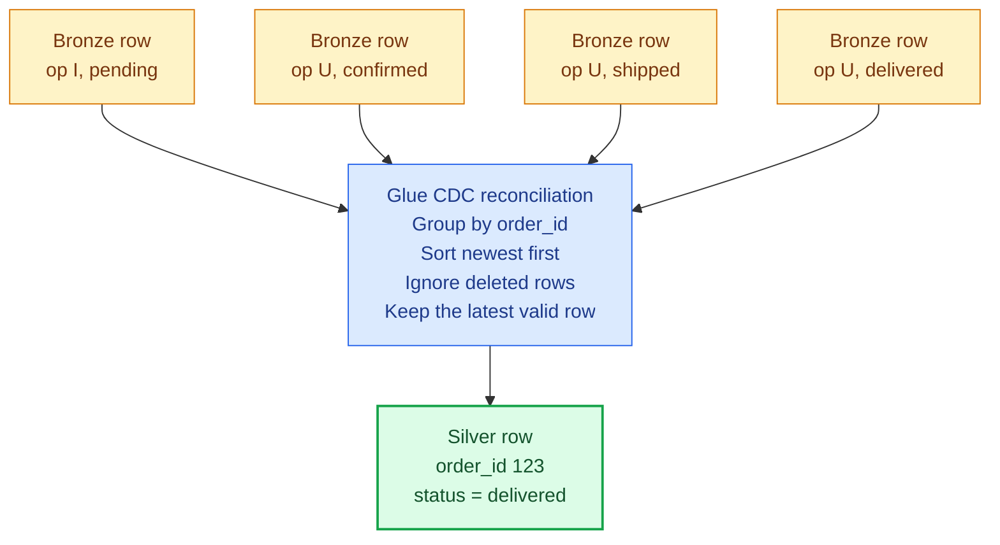
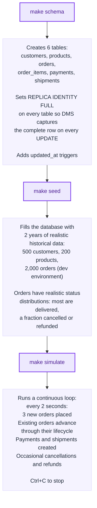
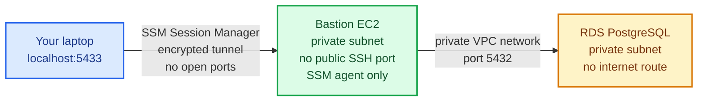
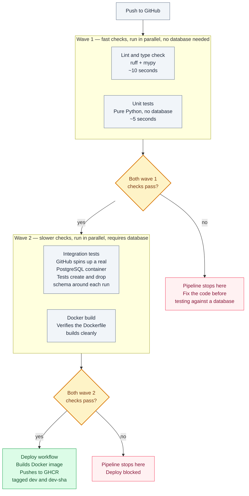
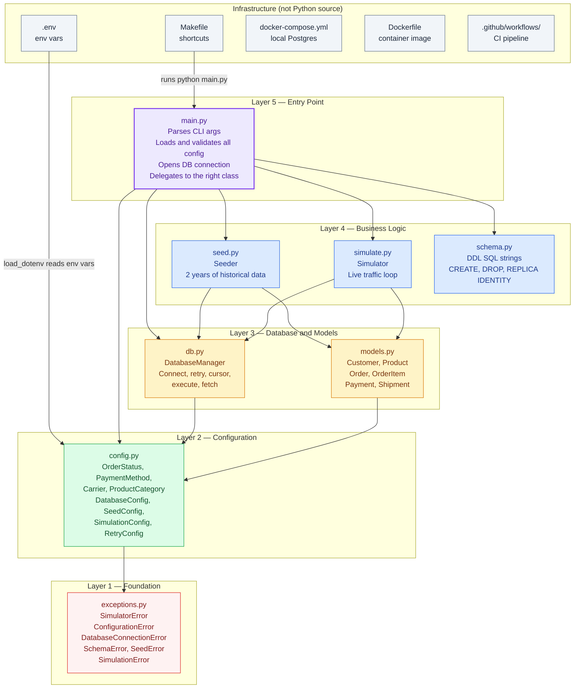

# platform-cdc-simulator

This repository is part of the [Enterprise Data Platform](https://github.com/enterprise-data-platform-emeka/platform-docs). For the full project overview, architecture diagram, and build order, start there.

**Previous:** [terraform-platform-infra-live](https://github.com/enterprise-data-platform-emeka/terraform-platform-infra-live) provisioned the VPC (Virtual Private Cloud), RDS (Relational Database Service) PostgreSQL, DMS (Database Migration Service) replication task, and S3 (Simple Storage Service) buckets that this simulator writes into.

---

A realistic e-commerce OLTP (Online Transaction Processing) data generator. It writes customer orders, payments, and shipments into a PostgreSQL database so AWS DMS can capture every change and forward it to the Bronze S3 layer as Parquet files. Without this simulator, there's no source data to flow through the pipeline.

---

## Contents

- [Before you start: Understanding CDC, WAL, and DMS](#before-you-start-understanding-cdc-wal-and-dms)
- [Beginner glossary](#beginner-glossary)
- [How this repository connects to the platform](#how-this-repository-connects-to-the-platform)
- [What lands in Bronze S3](#what-lands-in-bronze-s3)
- [What the simulator does](#what-the-simulator-does)
- [Data model](#data-model)
- [How much data it creates](#how-much-data-it-creates)
- [Prerequisites](#prerequisites)
- [Local setup (Docker)](#local-setup-docker)
- [Cloud setup (AWS RDS via SSM tunnel)](#cloud-setup-aws-rds-via-ssm-tunnel)
- [All commands](#all-commands)
- [Configuration reference](#configuration-reference)
- [Running tests](#running-tests)
- [Docker](#docker)
- [Code structure](#code-structure)
- [CI/CD](#cicd)

---

## Before you start: Understanding CDC, WAL, and DMS

If you're new to data engineering, three concepts in this project might not be obvious: CDC (Change Data Capture), WAL (Write-Ahead Log), and DMS. Understanding them makes everything else in the platform click into place.

### The problem: how do you keep a data warehouse in sync with a live database?

Imagine an e-commerce database. Every second: new orders are placed, existing orders change status, payments are confirmed, shipments are created. Your data warehouse needs to reflect all of this. How?

The obvious approach is **polling**: every hour, run a query like `SELECT * FROM orders WHERE updated_at > last_run`. This works, but has serious problems.

**CDC is the better approach.** Instead of querying, you subscribe to the database's own internal change log. Every change that happens in the database is recorded in that log before it's even written to the tables. You read the log and you get every change, in order, with nothing missed.

The simplest way to understand CDC is to compare it with polling:

| Approach | How it works | Beginner-friendly summary |
|---|---|---|
| Polling | A scheduled job repeatedly runs `SELECT * FROM table WHERE updated_at > last_run_time`. | Easy to start, but it can miss deletes, miss intermediate updates, and put load on the live database. |
| CDC | A replication reader subscribes to the database change log and receives every insert, update, and delete. | More reliable for pipelines because it follows the same stream the database uses for replication and recovery. |


```mermaid
flowchart TB
    classDef source fill:#dbeafe,stroke:#2563eb,color:#1e3a8a,stroke-width:1px
    classDef risk fill:#fff1f2,stroke:#f43f5e,color:#881337,stroke-width:1px
    classDef good fill:#dcfce7,stroke:#16a34a,color:#14532d,stroke-width:1px

    DB["Live PostgreSQL database"]:::source

    POLL["Polling job\nRuns SELECT on a schedule"]:::risk
    POLL_OUT["Possible issues\nDeletes are hard to detect\nIntermediate changes can be skipped\nData is stale between runs"]:::risk

    CDC["CDC reader\nSubscribes to the database log"]:::good
    CDC_OUT["Result\nEvery INSERT, UPDATE, DELETE\narrives as an event\nin the same order it happened"]:::good

    DB --> POLL --> POLL_OUT
    DB --> CDC --> CDC_OUT
```

### What is the WAL?

WAL stands for Write-Ahead Log. PostgreSQL writes every change to this log **before** it writes to the actual tables. This exists for crash recovery: if the database crashes mid-write, it can replay the WAL on restart to restore a consistent state.

This log is also how database **replication** works. When you create a read replica of a PostgreSQL database, the replica subscribes to the WAL of the primary and replays every change. AWS DMS uses the exact same mechanism. It connects to PostgreSQL as a replication client, reads the WAL stream, and forwards every change to S3.

### What is DMS?

AWS DMS (Database Migration Service) is a managed service that does two things in sequence:

1. **Full Load:** reads every existing row from every table and writes them to S3 as Parquet files. This is the starting snapshot.
2. **CDC stream:** after the full load, DMS stays connected to the WAL and writes every subsequent INSERT, UPDATE, and DELETE as raw CDC records in Parquet files.

This is what feeds the Bronze layer: one raw record per database event, timestamped, with the operation type (`op` column) preserved. Depending on batching, one Parquet file can contain multiple CDC records. The rest of the platform (Glue, dbt, the Analytics Agent) builds on top of these files.


```mermaid
sequenceDiagram
    participant PG as PostgreSQL RDS
    participant WAL as WAL
    participant DMS as AWS DMS
    participant S3 as Bronze S3

    PG->>DMS: Full Load starts
    DMS->>PG: Read existing rows from selected tables
    DMS->>S3: Write LOAD*.parquet snapshot files
    PG->>WAL: New INSERT/UPDATE/DELETE events continue
    DMS->>WAL: Subscribe as a replication client
    WAL->>DMS: Stream each committed change
    DMS->>S3: Write timestamped CDC Parquet files
```

## Beginner glossary

| Term | Meaning in this project |
|---|---|
| CDC (Change Data Capture) | Capturing row-level database changes as events instead of repeatedly querying tables. |
| WAL (Write-Ahead Log) | PostgreSQL's internal log of changes. PostgreSQL writes here before the table data is finalized. |
| DMS (Database Migration Service) | The AWS service that reads PostgreSQL changes and writes them to S3. |
| Full Load | The first snapshot DMS takes: every existing row is copied once. |
| CDC stream | The continuous phase after Full Load: every new insert, update, and delete is copied. |
| Bronze S3 | The raw, append-only landing zone. It stores what DMS wrote, without cleaning or deduplicating it. |
| Silver | The cleaned layer created later by Glue. It keeps the latest valid version of each entity. |
| `op` column | A DMS column that says what happened: `I` for insert, `U` for update, `D` for delete. |
| Parquet | A columnar file format used for efficient analytics queries on S3. |

---

## How this repository connects to the platform

This repository generates the source data. Everything downstream depends on it.

Read this flow in four small stages:

1. This repo creates and changes rows in PostgreSQL.
2. PostgreSQL records those changes in the WAL.
3. AWS DMS reads the WAL and writes raw Parquet files into Bronze S3.
4. The rest of the platform cleans, models, and serves that data.


```mermaid
flowchart TB
    classDef sim  fill:#ede9fe,stroke:#7c3aed,color:#4c1d95,stroke-width:2px
    classDef db   fill:#dbeafe,stroke:#2563eb,color:#1e3a8a,stroke-width:2px
    classDef dms  fill:#fef3c7,stroke:#d97706,color:#78350f,stroke-width:2px
    classDef brz  fill:#fef3c7,stroke:#d97706,color:#78350f,stroke-width:2px
    classDef down fill:#dcfce7,stroke:#16a34a,color:#14532d,stroke-width:2px

    subgraph REPO["1. This repository: generate realistic source traffic"]
        direction TB
        P1["make schema\nCreate 6 tables"]:::sim
        P2["make seed\nInsert historical data"]:::sim
        P3["make simulate\nKeep changing rows"]:::sim
        P1 --> P2 --> P3
    end

    subgraph PG_BOX["2. PostgreSQL source database"]
        direction TB
        DB["Tables\ncustomers, orders,\npayments, shipments"]:::db
        WAL["WAL\nEvery committed change\nis logged here"]:::db
        DB --> WAL
    end

    subgraph DMS_BOX["3. AWS DMS: copy source changes to S3"]
        direction TB
        D1["Full Load\nCopy existing rows once"]:::dms
        D2["CDC Stream\nCopy new changes continuously"]:::dms
        D1 --> D2
    end

    BRONZE["Bronze S3\nRaw Parquet files\nAppend-only audit trail"]:::brz

    subgraph NEXT["4. Downstream platform"]
        direction TB
        G["Glue PySpark\nReconcile CDC into Silver"]:::down
        D["dbt + Athena\nBuild Gold marts"]:::down
        A["Analytics Agent\nAnswer business questions"]:::down
        G --> D --> A
    end

    REPO --> DB
    WAL --> DMS_BOX
    DMS_BOX --> BRONZE
    BRONZE --> G

    style REPO    fill:#f5f3ff,stroke:#ddd6fe,stroke-width:1px
    style DMS_BOX fill:#fffbeb,stroke:#fde68a,stroke-width:1px
    style NEXT    fill:#f0fdf4,stroke:#bbf7d0,stroke-width:1px
```

---

## What lands in Bronze S3

This is the key concept to understand before working with the rest of the platform.

In a real e-commerce system, one order goes through multiple status changes. It starts as `pending`, gets confirmed, ships, and eventually delivers. Each of those status changes is a separate database event. DMS writes each event as a **raw CDC record** in Bronze with an `op` column that records what happened.


```mermaid
flowchart TB
    classDef db fill:#dbeafe,stroke:#2563eb,color:#1e3a8a,stroke-width:1px
    classDef dms fill:#fef3c7,stroke:#d97706,color:#78350f,stroke-width:1px
    classDef out fill:#dcfce7,stroke:#16a34a,color:#14532d,stroke-width:1px

    A["Database event 1\nINSERT order_id 123\nstatus = pending"]:::db
    B["Database event 2\nUPDATE order_id 123\nstatus = confirmed"]:::db
    C["Database event 3\nUPDATE order_id 123\nstatus = shipped"]:::db
    D["Database event 4\nUPDATE order_id 123\nstatus = delivered"]:::db

    DMS["AWS DMS reads each event\nfrom the PostgreSQL WAL"]:::dms

    F["Bronze S3 receives 4 raw records\nfor the same order_id\nNothing is deduplicated here"]:::out

    A --> DMS
    B --> DMS
    C --> DMS
    D --> DMS
    DMS --> F
```

This is why Bronze is called "raw": it contains every event, not just the current state. The Silver layer (produced by Glue) is where those events get collapsed into one clean row per entity.

The `op` column values are:
- `I` — an INSERT (a new row was created)
- `U` — an UPDATE (an existing row was changed; DMS captures the full row after the change)
- `D` — a DELETE (a row was removed; DMS captures the last known row before deletion)

For one order, Bronze might look like this:

| `order_id` | `op` | `order_status` | What this row means |
|---|---:|---|---|
| `123` | `I` | `pending` | The order was created. |
| `123` | `U` | `confirmed` | The same order changed status. |
| `123` | `U` | `shipped` | The same order changed status again. |
| `123` | `U` | `delivered` | This is the latest known version. |

Bronze keeps all four rows because Bronze is an audit trail. Silver keeps only the latest valid row because Silver is the clean current-state layer.


```mermaid
flowchart TB
    classDef raw fill:#fef3c7,stroke:#d97706,color:#78350f,stroke-width:1px
    classDef job fill:#dbeafe,stroke:#2563eb,color:#1e3a8a,stroke-width:1px
    classDef clean fill:#dcfce7,stroke:#16a34a,color:#14532d,stroke-width:2px

    B1["Bronze row\nop I, pending"]:::raw
    B2["Bronze row\nop U, confirmed"]:::raw
    B3["Bronze row\nop U, shipped"]:::raw
    B4["Bronze row\nop U, delivered"]:::raw

    GLUE["Glue CDC reconciliation\nGroup by order_id\nSort newest first\nIgnore deleted rows\nKeep the latest valid row"]:::job

    SILVER["Silver row\norder_id 123\nstatus = delivered"]:::clean

    B1 --> GLUE
    B2 --> GLUE
    B3 --> GLUE
    B4 --> GLUE
    GLUE --> SILVER
```

---

## What the simulator does

The simulator runs three phases in sequence. Each phase builds on the previous one.


```mermaid
flowchart TB
    classDef phase fill:#ede9fe,stroke:#7c3aed,color:#4c1d95,stroke-width:2px
    classDef note  fill:#f1f5f9,stroke:#64748b,color:#1e293b,stroke-width:1px

    P1["make schema"]:::phase
    P2["make seed"]:::phase
    P3["make simulate"]:::phase

    N1["Creates 6 tables:\ncustomers, products, orders,\norder_items, payments, shipments\n\nSets REPLICA IDENTITY FULL\non every table so DMS captures\nthe complete row on every UPDATE\n\nAdds updated_at triggers"]:::note
    N2["Fills the database with\n2 years of realistic historical data:\n500 customers, 200 products,\n2,000 orders (dev environment)\n\nOrders have realistic status\ndistributions: most are delivered,\na fraction cancelled or refunded"]:::note
    N3["Runs a continuous loop:\nevery 2 seconds:\n3 new orders placed\nExisting orders advance\nthrough their lifecycle\nPayments and shipments created\nOccasional cancellations and refunds\n\nCtrl+C to stop"]:::note

    P1 --> N1 --> P2 --> N2 --> P3 --> N3

    style N1 fill:#f5f3ff,stroke:#ddd6fe,stroke-width:1px
    style N2 fill:#f5f3ff,stroke:#ddd6fe,stroke-width:1px
    style N3 fill:#f5f3ff,stroke:#ddd6fe,stroke-width:1px
```

Every write the simulator makes lands in PostgreSQL's WAL, which DMS picks up and forwards to Bronze S3.

---

## Data model

Six tables that model a European e-commerce business. Two reference tables hold customers and products (they change rarely). Four transaction tables record business events.

```
customers ──< orders ──< order_items >── products
               │
               ├──< payments
               └──< shipments
```

| Table | Key columns |
|---|---|
| `customers` | customer_id, first_name, last_name, email, country, phone, signup_date |
| `products` | product_id, name, category, brand, unit_price, stock_qty |
| `orders` | order_id, customer_id, order_date, order_status |
| `order_items` | order_item_id, order_id, product_id, quantity, unit_price, line_total |
| `payments` | payment_id, order_id, method, amount, status, payment_date |
| `shipments` | shipment_id, order_id, carrier, delivery_status, shipped_date, delivered_date |

Every table has an `updated_at` column that updates automatically on every row change via a PostgreSQL trigger.

**Order lifecycle:** `pending` → `confirmed` → `processing` → `shipped` → `delivered`

Terminal states (no further transitions): `delivered`, `cancelled`, `refunded`

**Why `REPLICA IDENTITY FULL`?**

By default, PostgreSQL only writes the **changed columns** to the WAL on an UPDATE. For example, if only the `order_status` column changes, the WAL entry only contains `order_status`. DMS can't build a complete Parquet row from just one column.

Setting `REPLICA IDENTITY FULL` tells PostgreSQL to write the **entire row** to the WAL on every UPDATE, not just what changed. DMS can then produce a complete Parquet record for every event.

---

## How much data it creates

The simulator respects per-environment limits so it never creates more data than needed:

| Environment | Max orders | Seed customers | Seed products | Seed historical orders |
|---|---|---|---|---|
| `dev` | 5,000 | 500 | 200 | 2,000 |
| `staging` | 10,000 | 1,000 | 400 | 5,000 |
| `prod` | 15,000 | 2,000 | 800 | 10,000 |

Once the order limit is reached, the simulator stops creating new orders but keeps advancing existing ones through their lifecycle. The CDC stream stays active without the database growing indefinitely.

---

## Prerequisites

**For local development:**

- Python 3.11.8, managed by pyenv (see setup below)
- Docker Desktop, for the local PostgreSQL container
- Git

**For AWS (in addition to the above):**

- AWS CLI configured with SSO profiles (`dev-admin`, `staging-admin`, `prod-admin`)
- AWS SSM (Systems Manager) Session Manager Plugin:
  ```bash
  brew install --cask session-manager-plugin
  ```
- Terraform infrastructure applied (`make apply dev` in `terraform-platform-infra-live`)

---

## Local setup (Docker)

This runs everything locally in Docker. No AWS account or costs involved.

**Step 1: Install pyenv**

pyenv manages Python versions. The `.python-version` file in this repo tells pyenv to use 3.11.8 automatically when you `cd` into the project.

```bash
brew install pyenv
echo 'export PYENV_ROOT="$HOME/.pyenv"' >> ~/.zshrc
echo '[[ -d $PYENV_ROOT/bin ]] && export PATH="$PYENV_ROOT/bin:$PATH"' >> ~/.zshrc
echo 'eval "$(pyenv init -)"' >> ~/.zshrc
source ~/.zshrc
pyenv install 3.11.8
```

Verify: `python --version` should show `Python 3.11.8` inside this directory.

**Step 2: Create the virtual environment**

```bash
cd platform-cdc-simulator
make setup
```

This creates a `.venv` folder with all Python packages installed, isolated from anything else on the system.

**Step 3: Configure the environment**

```bash
cp .env.example .env
```

The `.env` file already has the right values for local Docker development. Nothing needs to change.

**Step 4: Start the local PostgreSQL database**

```bash
make docker-up
```

This starts a PostgreSQL container on port 5432. It also creates two databases:
- `ecommerce`: the simulator's database
- `ecommerce_test`: used by the integration test suite (keeps test runs isolated from simulator data)

Wait for the output `PostgreSQL is ready.` before continuing.

**Step 5: Create the schema and seed data**

```bash
make schema    # create the six tables, indexes, and triggers
make seed      # fill with 2 years of historical data
```

**Step 6: Run the simulator**

```bash
make simulate  # starts the live traffic loop — Ctrl+C to stop
```

The simulator logs output every few seconds showing new orders being placed and existing ones advancing. Every write lands in the PostgreSQL WAL. If you're running against AWS RDS with DMS active, those changes appear in Bronze S3 within 1-2 minutes.

**Reset to a clean state at any time:**

```bash
make reset     # drops all tables, recreates schema, reseeds — destroys all data
```

---

## Cloud setup (AWS RDS via SSM tunnel)

RDS lives in private subnets with no internet route. To connect from a local machine, I open an SSM (Systems Manager) port-forwarding session through the bastion EC2 (Elastic Compute Cloud) instance Terraform creates. No SSH keys and no open firewall ports are needed.


```mermaid
flowchart LR
    classDef local fill:#dbeafe,stroke:#2563eb,color:#1e3a8a,stroke-width:2px
    classDef aws   fill:#dcfce7,stroke:#16a34a,color:#14532d,stroke-width:2px
    classDef priv  fill:#fef3c7,stroke:#d97706,color:#78350f,stroke-width:2px

    LAP["Your laptop\nlocalhost:5433"]:::local
    BAS["Bastion EC2\nprivate subnet\nno public SSH port\nSSM agent only"]:::aws
    RDS["RDS PostgreSQL\nprivate subnet\nno internet route"]:::priv

    LAP -->|"SSM Session Manager\nencrypted tunnel\nno open ports"| BAS
    BAS -->|"private VPC network\nport 5432"| RDS
```

**Before starting:**

1. Infrastructure is applied: `make apply dev` completed in `terraform-platform-infra-live`
2. SSM Session Manager Plugin is installed: `brew install --cask session-manager-plugin`
3. AWS SSO session is active: `aws sso login --profile dev-admin`

**Step 1: Get the tunnel command**

After `make apply dev`, Terraform prints an `ssm_tunnel_command` output. Copy it:

```
ssm_tunnel_command = "aws ssm start-session --target i-0abc123 --document-name AWS-StartPortForwardingSessionToRemoteHost --parameters 'host=edp-dev-source-db.xxx.eu-central-1.rds.amazonaws.com,portNumber=5432,localPortNumber=5433' --profile dev-admin"
```

To retrieve it later:

```bash
cd terraform-platform-infra-live/environments/dev
terraform output ssm_tunnel_command
```

**Step 2: Open the SSM tunnel (Terminal 1)**

Paste and run the command. You'll see:

```
Starting session with SessionId: dev-admin-xxxxxxxxxx
Port 5433 forwarded
Waiting for connections...
```

Leave this terminal open. The tunnel must stay running while the simulator is active.

**Step 3: Run the simulator (Terminal 2)**

```bash
cd platform-cdc-simulator
make schema ENV=dev     # create tables on AWS RDS
make seed   ENV=dev     # seed historical data
make simulate ENV=dev   # run the live traffic loop (Ctrl+C to stop)
```

The Makefile fetches the RDS password live from AWS SSM Parameter Store. No password file is ever created on disk:

```bash
aws ssm get-parameter \
  --name /edp/dev/rds/db_password \
  --with-decryption \
  --query Parameter.Value \
  --output text \
  --profile dev-admin
```

**Step 4: Verify data in S3 (optional)**

Once DMS picks up the changes (usually within 1-2 minutes of starting the DMS task), Parquet files appear in the Bronze bucket:

```bash
aws s3 ls s3://edp-dev-{account-id}-bronze/raw/ --recursive --profile dev-admin
```

**Step 5: Stop and clean up**

Stop the simulator with Ctrl+C in Terminal 2. Close the SSM tunnel with Ctrl+C in Terminal 1. Then destroy all infrastructure:

```bash
cd terraform-platform-infra-live
make destroy dev
```

---

## All commands

```bash
# Setup
make setup              # create .venv and install all dependencies

# Code quality
make lint               # run ruff linter
make typecheck          # run mypy type checker
make test               # run all tests (unit + integration, reads .env)
make test-unit          # run unit tests only (no database required)
make test-integration   # run integration tests (requires a running PostgreSQL)

# Simulator — local Docker (reads .env)
make schema             # create tables, indexes, triggers
make seed               # seed 2 years of historical data
make simulate           # run the live traffic loop (Ctrl+C to stop)
make reset              # drop + recreate + reseed (destroys all data)

# Simulator — AWS RDS (SSM tunnel must be open first)
make schema ENV=dev     # create tables on AWS dev RDS
make seed   ENV=dev     # seed on AWS dev RDS
make simulate ENV=dev   # run loop against AWS dev RDS
make reset  ENV=dev     # reset AWS dev RDS (destroys all data)

# Docker
make docker-up          # start local PostgreSQL container
make docker-down        # stop and remove containers
make docker-logs        # tail container logs
make docker-build       # build the simulator Docker image
make docker-simulate    # start PostgreSQL + simulator together in Docker

# Cleanup
make clean              # remove .venv and Python cache files
```

---

## Configuration reference

All configuration comes from environment variables. For local runs, these are loaded from `.env`. For AWS runs (`ENV=dev/staging/prod`), the Makefile sets them inline.

| Variable | Required | Default | Description |
|---|---|---|---|
| `ENVIRONMENT` | Yes | none | `dev`, `staging`, or `prod`. Controls record limits. |
| `DB_HOST` | Yes | none | PostgreSQL hostname. `localhost` for both Docker and SSM tunnel. |
| `DB_PORT` | No | `5432` | `5432` for Docker, `5433` for SSM tunnel (local port). |
| `DB_NAME` | Yes | none | Database name. `ecommerce` in all environments. |
| `DB_USER` | Yes | none | Database user. `postgres` in all environments. |
| `DB_PASSWORD` | Yes | none | Database password. Set in `.env` for local, fetched from SSM for AWS. |
| `TEST_DB_NAME` | No | `ecommerce_test` | Database for integration tests. Never the same as `DB_NAME`. |
| `SEED_CUSTOMERS` | No | env default | Override seed customer count. |
| `SEED_PRODUCTS` | No | env default | Override seed product count. |
| `SEED_HISTORICAL_ORDERS` | No | env default | Override seed order count. |
| `SEED_RANDOM_SEED` | No | `42` | Random seed for reproducible data generation. |
| `SIM_TICK_INTERVAL_SECONDS` | No | `2` | Seconds between simulation ticks. |
| `SIM_NEW_ORDERS_PER_TICK` | No | `3` | New orders placed per tick. |
| `SIM_MAX_ORDERS` | No | env default | Override the environment order cap. |
| `RETRY_MAX_ATTEMPTS` | No | `5` | Max DB reconnection attempts on connection loss. |
| `RETRY_WAIT_MIN_SECONDS` | No | `1` | Minimum wait between retry attempts. |
| `RETRY_WAIT_MAX_SECONDS` | No | `30` | Maximum wait between retry attempts. |

Copy `.env.example` to `.env` and fill in the values. The real `.env` is in `.gitignore`, so passwords never end up in git.

---

## Running tests

There are two types of tests. Unit tests check individual pieces of logic in isolation, with no database needed. Integration tests check the full application against a real PostgreSQL database.

I didn't use CSV fixtures here, which is the typical approach. A CSV is static: the moment the schema changes, the CSV goes out of date and the tests silently lie. Instead, the integration tests create the actual PostgreSQL schema from scratch before each test and drop it after. The real schema becomes the test environment.


```mermaid
flowchart TD
    classDef pass fill:#dcfce7,stroke:#16a34a,color:#14532d,stroke-width:1px
    classDef fail fill:#fff1f2,stroke:#f43f5e,color:#881337,stroke-width:1px
    classDef step fill:#f1f5f9,stroke:#64748b,color:#1e293b,stroke-width:1px
    classDef gate fill:#fef3c7,stroke:#d97706,color:#78350f,stroke-width:2px

    PUSH["Push to GitHub"]:::step

    subgraph W1["Wave 1 — fast checks, run in parallel, no database needed"]
        direction LR
        LINT["Lint and type check\nruff + mypy\n~10 seconds"]:::step
        UNIT["Unit tests\nPure Python, no database\n~5 seconds"]:::step
    end

    GATE{"Both wave 1\nchecks pass?"}:::gate

    STOP1["Pipeline stops here\nFix the code before\ntesting against a database"]:::fail

    subgraph W2["Wave 2 — slower checks, run in parallel, requires database"]
        direction LR
        INT["Integration tests\nGitHub spins up a real\nPostgreSQL container\nTests create and drop\nschema around each run"]:::step
        BUILD["Docker build\nVerifies the Dockerfile\nbuilds cleanly"]:::step
    end

    GATE2{"Both wave 2\nchecks pass?"}:::gate

    DEPLOY["Deploy workflow\nBuilds Docker image\nPushes to GHCR\ntagged dev and dev-sha"]:::pass

    STOP2["Pipeline stops here\nDeploy blocked"]:::fail

    PUSH --> W1
    W1 --> GATE
    GATE -->|"yes"| W2
    GATE -->|"no"| STOP1
    W2 --> GATE2
    GATE2 -->|"yes"| DEPLOY
    GATE2 -->|"no"| STOP2
```

**Unit tests (no database required):**

```bash
make test-unit
```

**Integration tests:**

For local Docker:
```bash
make docker-up
make test
```

For AWS RDS (SSM tunnel must be open):
```bash
make test ENV=dev
```

Integration tests use `TEST_DB_NAME` (default: `ecommerce_test`), never `DB_NAME`. Running the full test suite can never touch or corrupt real simulator data.

**Test coverage:**

| File | Type | What it tests |
|---|---|---|
| `test_exceptions.py` | Unit | Exception hierarchy and message preservation |
| `test_config.py` | Unit | Domain constants, env var loading, password redaction in repr |
| `test_models.py` | Unit | Model factories, `as_insert_tuple()`, `line_total` calculation |
| `test_schema.py` | Unit | SQL strings contain all table names, `REPLICA IDENTITY FULL`, `CASCADE` |
| `test_db.py` | Integration | Connect, execute, fetch, bulk insert, transaction rollback |

---

## Docker

**Local development stack:**

```bash
make docker-up        # start PostgreSQL only (recommended for development)
make docker-simulate  # start PostgreSQL + simulator together
make docker-down      # stop everything
make docker-logs      # tail logs from all containers
```

**Build and push the simulator image:**

```bash
make docker-build     # builds cdc-simulator:latest locally
```

The `Dockerfile` uses a two-stage build: stage one installs Python packages, stage two copies only what's needed into a slim final image. The container runs as a non-root user. On merge to `main`, GitHub Actions automatically builds and pushes the image to GitHub Container Registry.

---

## Code structure

Each file has one clearly defined role. Files in higher layers only import from lower layers, never sideways or upward. This one-way dependency flow keeps changes predictable.


```mermaid
flowchart TD
    classDef infra fill:#f1f5f9,stroke:#64748b,color:#1e293b,stroke-width:1px
    classDef entry fill:#ede9fe,stroke:#7c3aed,color:#4c1d95,stroke-width:2px
    classDef logic fill:#dbeafe,stroke:#2563eb,color:#1e3a8a,stroke-width:1px
    classDef data  fill:#fef3c7,stroke:#d97706,color:#78350f,stroke-width:1px
    classDef cfg   fill:#dcfce7,stroke:#16a34a,color:#14532d,stroke-width:1px
    classDef found fill:#fef2f2,stroke:#dc2626,color:#7f1d1d,stroke-width:1px

    subgraph infra_g["Infrastructure (not Python source)"]
        direction LR
        E[".env\nenv vars"]:::infra
        MK["Makefile\nshortcuts"]:::infra
        DC["docker-compose.yml\nlocal Postgres"]:::infra
        DF["Dockerfile\ncontainer image"]:::infra
        CI[".github/workflows/\nCI pipeline"]:::infra
    end

    subgraph l5["Layer 5 — Entry Point"]
        MAIN["main.py\nParses CLI args\nLoads and validates all config\nOpens DB connection\nDelegates to the right class"]:::entry
    end

    subgraph l4["Layer 4 — Business Logic"]
        SEED["seed.py\nSeeder\n2 years of historical data"]:::logic
        SIM["simulate.py\nSimulator\nLive traffic loop"]:::logic
        SCH["schema.py\nDDL SQL strings\nCREATE, DROP, REPLICA IDENTITY"]:::logic
    end

    subgraph l3["Layer 3 — Database and Models"]
        DB["db.py\nDatabaseManager\nConnect, retry, cursor,\nexecute, fetch"]:::data
        MOD["models.py\nCustomer, Product\nOrder, OrderItem\nPayment, Shipment"]:::data
    end

    subgraph l2["Layer 2 — Configuration"]
        CFG["config.py\nOrderStatus, PaymentMethod,\nCarrier, ProductCategory\nDatabaseConfig, SeedConfig,\nSimulationConfig, RetryConfig"]:::cfg
    end

    subgraph l1["Layer 1 — Foundation"]
        EXC["exceptions.py\nSimulatorError\nConfigurationError\nDatabaseConnectionError\nSchemaError, SeedError\nSimulationError"]:::found
    end

    E  -->|"load_dotenv reads env vars"| CFG
    MK -->|"runs python main.py"| MAIN

    MAIN --> SEED & SIM & SCH & DB & CFG

    SEED --> DB & MOD
    SIM  --> DB & MOD

    DB  --> CFG
    MOD --> CFG
    CFG --> EXC
```

**What each file does:**

| File | Role |
|---|---|
| `main.py` | CLI entry point. Parses `schema / seed / simulate / reset`, validates all config before opening a DB connection, then calls the right class. The only file that touches every layer. |
| `simulator/config.py` | Domain constants (`OrderStatus`, `PaymentMethod`, `Carrier`, etc.) and frozen config dataclasses. `ENVIRONMENT` drives record limits automatically. |
| `simulator/db.py` | `DatabaseManager` wraps psycopg2. Handles connect with exponential-backoff retry, a `cursor()` context manager that auto-commits on success and rolls back on failure, and helpers for bulk inserts and reads. |
| `simulator/models.py` | Dataclasses for each table. Each has a `generate()` factory using Faker and an `as_insert_tuple()` method that matches the INSERT column order. |
| `simulator/schema.py` | Pure SQL DDL strings: CREATE TABLE, indexes, `updated_at` triggers, `REPLICA IDENTITY FULL`, and DROP TABLE. No Python logic. |
| `simulator/seed.py` | `Seeder` class. Inserts customers and products first, then creates historical orders with realistic lifecycle distributions. Raises `SeedError` on any failure. Never partial. |
| `simulator/simulate.py` | `Simulator` class. Runs the continuous tick loop. `DatabaseConnectionError` triggers a reconnect; all other errors crash loudly so nothing fails silently. |
| `simulator/exceptions.py` | Exception hierarchy rooted at `SimulatorError`. Named exceptions mean callers catch exactly what they expect and everything else surfaces with full context. |
| `tests/conftest.py` | Shared pytest fixtures. The `db` fixture uses `TEST_DB_NAME` and creates and drops the schema around each test, so tests never touch simulator data. |

---

## CI/CD

CI skips runs triggered by README or `.env.example` changes. Only source code, configuration, and Dockerfile changes trigger the pipeline.

**On every pull request and push to main**, four jobs run in two waves:

Wave 1 (parallel, no database needed): lint and type check (ruff + mypy), unit tests.

Wave 2 (only if wave 1 passes, parallel): integration tests against a GitHub-provisioned PostgreSQL service container, Docker build verification.

**On merge to main**, the deploy workflow builds the Docker image and pushes it to GitHub Container Registry (GHCR) tagged as `dev` and `dev-{sha}`. Authentication uses the built-in `GITHUB_TOKEN`, no AWS credentials needed.

**Promotion to staging and prod**: trigger the Deploy workflow manually, choose the target environment. The `prod` push also updates the `latest` tag. GitHub Environment protection rules require reviewer approval for staging and prod.

---

**Next:** [platform-glue-jobs](https://github.com/enterprise-data-platform-emeka/platform-glue-jobs): with Bronze CDC files landing in S3, the six PySpark jobs reconcile those records into a clean Silver star schema, discarding duplicates and quarantining invalid data.
